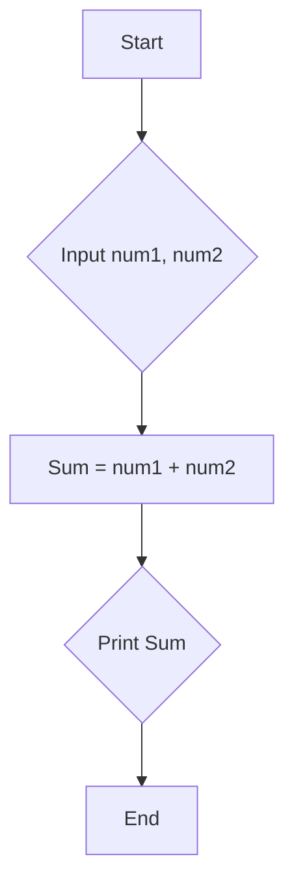
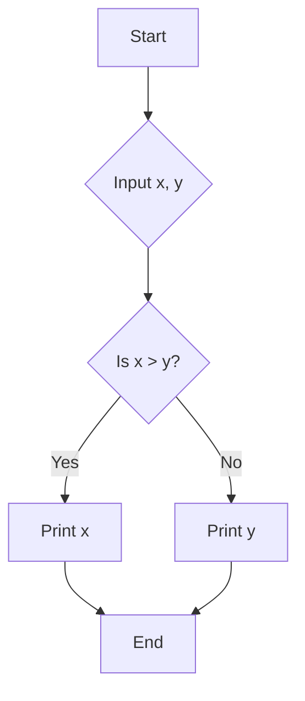
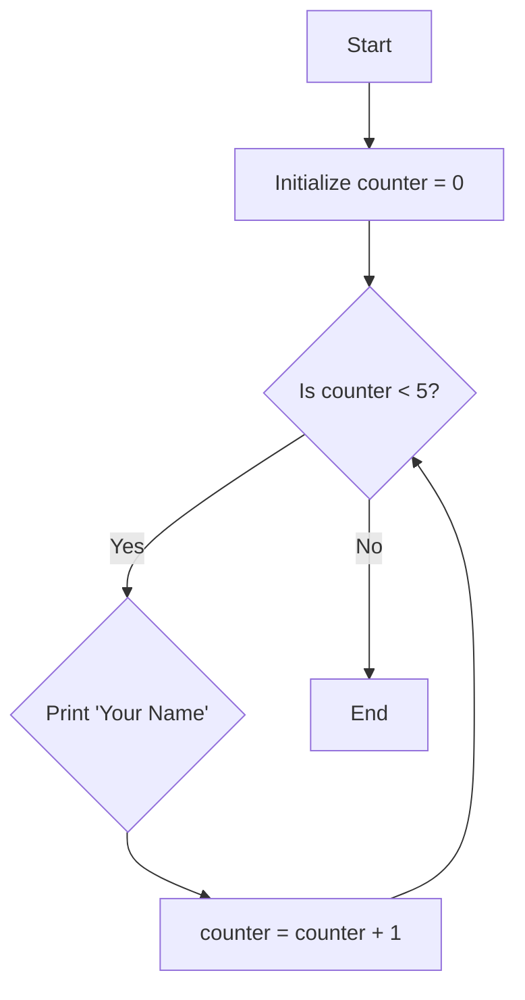

### Notes: Flowcharts

#### 1. Introduction: What is a Flowchart?

A flowchart is a **visual or graphical representation of an algorithm**. Think of it as a **blueprint for a program**. It uses a set of standard symbols to map out the sequence of steps, decisions, and the overall flow of logic required to solve a specific problem.

The primary purpose of a flowchart is to plan and visualize the logic *before* writing any code. This allows you to identify potential issues, simplify complex processes, and communicate your plan to others easily.

**Key Characteristics:**
*   **Visual Clarity:** It's easier to understand the flow of a program from a diagram than from lines of text.
*   **Language-Independent:** Flowcharts are not tied to any specific programming language (like C, Python, or Java). They represent pure logic.
*   **Problem-Solving Tool:** They help in breaking down a large problem into smaller, manageable steps.

#### 2. Essential Flowchart Symbols

These are the fundamental building blocks of any flowchart.

| Symbol | Name | Purpose and Explanation |
| :--- | :--- | :--- |
| **Oval** | **Terminator** | Represents the **Start** and **End** points of the program. Every flowchart must begin with a "Start" and conclude with an "End". |
| **Parallelogram** | **Input / Output** | Used for any operation that involves getting data from the user (**Input**) or displaying information (**Output**). Examples: `Read num1`, `Print Sum`. |
| **Rectangle** | **Process** | Represents any calculation, data manipulation, or operation. This is where the "work" gets done. Examples: `Sum = num1 + num2`, `i = i + 1`. |
| **Diamond** | **Decision** | Asks a **yes/no** or **true/false** question. It always has one entry point and two exit points (e.g., a "Yes" branch and a "No" branch), which dictates the flow of the program. Example: `Is x > y?`. |
| **Arrow** | **Flow Line** | Connects the symbols and indicates the direction of logical flow. The program executes by following the arrows from one symbol to the next. |
| **Circle** | **On-Page Connector** | Used to connect two parts of a flowchart that are on the **same page**. This helps to avoid long or crossing flow lines, keeping the diagram clean. |
| **Home Plate** | **Off-Page Connector** | Used to connect a flowchart that is too large to fit on a single page. It indicates that the flow continues on another page. |

#### 3. Fundamental Flowchart Structures

All complex logic in programming is built from three basic control structures.

**A. Sequence Structure**
This is the simplest structure. It represents a series of actions that are performed one after the other in a linear sequence, with no branching.

*   **Example:** Calculating the sum of two numbers.

**B. Decision (or Selection) Structure**
This structure is used when the program must choose between two or more paths based on a condition. It uses the diamond (Decision) symbol.

*   **Logic:** `IF` a condition is true, `THEN` perform one action, `ELSE` perform another action.
*   **Example:** Finding the larger of two numbers.

**C. Repetition (or Looping) Structure**
This structure allows a block of instructions to be executed repeatedly as long as a certain condition remains true. This is commonly known as a **loop**.

*   **Logic:** `WHILE` a condition is true, keep performing a set of actions.
*   **Example:** Printing your name 5 times.

#### 4. Guidelines and Best Practices for Creating Flowcharts

1.  **Unified Flow:** A flowchart should generally flow from **top to bottom** and **left to right**.
2.  **One Start, One End:** Every flowchart must have only **one Start** symbol and **one End** symbol to ensure a clear entry and exit point.
3.  **Clarity is Key:** The text inside the symbols should be brief, clear, and easy to understand. Avoid technical jargon where possible.
4.  **No Crossing Lines:** Use **Connectors** (On-Page or Off-Page) to prevent your flow lines from crossing, which can make the diagram confusing.
5.  **Logical Completeness:** Ensure that the logic is complete. The decision symbol, for instance, must account for all possible outcomes (typically 'yes' and 'no').

#### 5. Advantages of Using Flowcharts

*   **Effective Communication:** Provides a common language for programmers, clients, and managers to understand a system's logic.
*   **Efficient Analysis:** Helps in analyzing the problem and identifying all the necessary steps and potential edge cases.
*   **Proper Documentation:** Serves as a permanent visual record of the program's logic, which is invaluable for future maintenance and updates.
*   **Simplified Coding:** Acts as a direct guide or blueprint, making the transition to writing actual code much easier and less error-prone.
*   **Easier Debugging:** When a program has a logical error, tracing the flow through the flowchart can often help pinpoint exactly where the logic went wrong.

